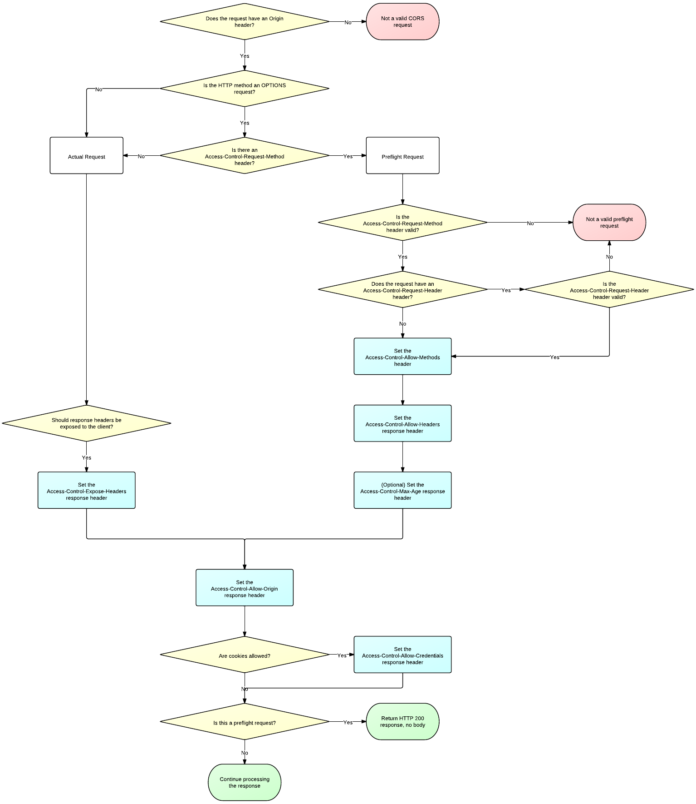

# 使用CORS

## 简介

API是富网络应用体验的素材。不过这些素材很难顺畅地在浏览器上组合，因为可供选择的跨域请求方案不尽完善，譬如[JSON-P](https://en.wikipedia.org/wiki/JSONP)（由于安全问题限制了使用）；又譬如设置代理服务器（设置和维护比较麻烦）。

[Cross-Origin Resource Sharing](http://www.w3.org/TR/cors/)（CORS）是一种允许浏览器发起跨域连接的W3C标准。它完全基于XMLHttpRequest对象[^footnote-1]，使得开发者可以使用和同域请求一样的语法去处理跨域请求。

CORS的使用场景很简单。我们假设`bob.com`站点想要访问`alice.com`站点的某些数据。这种类型的请求由于浏览器的[同源策略](https://en.wikipedia.org/wiki/Same-origin_policy)通常是不被允许的。不过，如果支持CORS请求，那么`alice.com`站点就可以通过增加一些特定的响应头信息来接受`bob.com`站点的数据访问。

从上述例子可看到，需要服务器和客户端的协同才能实现CORS支持。当然，如果你是客户端开发者，那么你可以很幸运地略过大部分的实现细节。本文的余下部分会同时说明客户端如何发送跨域请求，以及如何配置服务器以支持CORS。

## 发送CORS请求

本节讲解用javascript如何发送跨域请求。

### 生成XMLHttpRequest实例对象

目前以下浏览器都支持CORS：

* Chrome 3+
* Firefox 3.5+
* Opera 12+
* Safari 4+
* Internet Explorer 8+

（兼容CORS的完整浏览器列表参见[http://caniuse.com/#search=cors](http://caniuse.com/#search=cors)）

Chrome, Firefox, Opera和Safari浏览器使用的是[XMLHttpRequest2对象](http://www.html5rocks.com/en/tutorials/file/xhr2/)。IE浏览器使用的是类似的XDomainRequest对象，它和XMLHttpRequest大致相同，但多了一些[安全措施](http://blogs.msdn.com/b/ieinternals/archive/2010/05/13/xdomainrequest-restrictions-limitations-and-workarounds.aspx)。

首先需要正确创建一个请求对象。Nicholas Zakas写了[一个简单的helper函数](http://www.nczonline.net/blog/2010/05/25/cross-domain-ajax-with-cross-origin-resource-sharing/)来解决浏览器差异：

```javascript
function createCORSRequest(method, url) {
  var xhr = new XMLHttpRequest();
  if ("withCredentials" in xhr) {

    // Check if the XMLHttpRequest object has a "withCredentials" property.
    // "withCredentials" only exists on XMLHTTPRequest2 objects.
    xhr.open(method, url, true);

  } else if (typeof XDomainRequest != "undefined") {

    // Otherwise, check if XDomainRequest.
    // XDomainRequest only exists in IE, and is IE's way of making CORS requests.
    xhr = new XDomainRequest();
    xhr.open(method, url);

  } else {

    // Otherwise, CORS is not supported by the browser.
    xhr = null;

  }
  return xhr;
}

var xhr = createCORSRequest('GET', url);
if (!xhr) {
  throw new Error('CORS not supported');
}
```

### 事件

原生的XMLHttpRequest对象只暴露了一个事件，onreadystatechange，来处理所有的响应。XMLHttpRequest2对象保留了这个事件，并且引入了不少新的事件。下面是完整的列表：

事件处理函数 | 描述
-----|-----
onloadstart* | 发起请求时触发
onprogress   | 加载、发送数据时触发
onabort*     | 丢弃请求时触发。譬如调用.abort()方法时
onerror      | 请求失败时触发
onload       | 请求成功完成时触发
ontimeout    | 当超过了预设时间还未完成请求时触发
onloadend*   | 当请求完成（无论成功与否）时触发

（IE的XDomainRequest不支持带*号的事件）

来源：[http://www.w3.org/TR/XMLHttpRequest2/#events](http://www.w3.org/TR/XMLHttpRequest2/#events)

大部分情况下，你只需要用到onload和onerror事件：

```javascript
xhr.onload = function() {
 var responseText = xhr.responseText;
 console.log(responseText);
 // process the response.
};

xhr.onerror = function() {
  console.log('There was an error!');
};
```

当请求发生错误时，浏览器并没有很好地提供错误信息。譬如Firefox在任何错误发生时都只会返回status 0和空的statusText。当然，浏览器会在调试控制台中输出错误信息，只是我们无法从javascript中访问这个信息。当处理onerror事件时，我们能获知发生了错误，但无法获取进一步的信息。

### withCredentials

标准的CORS请求默认不发送或者设置任何cookies。如需在请求中携带cookies，可以把XMLHttpRequest对象的.withCredentials属性设置成true：

```javascript
xhr.withCredentials = true;
```

要使这段代码正常运作，服务器也需要通过把响应头Access-Control-Allow-Credentials设置为"true"来开启credentials。详见下面的服务器设置部分。

```
Access-Control-Allow-Credentials: true
```

.withCredentials会使得请求带上服务器的所有cookies，并且也会为会话设置从服务器带来的所有cookies。这里注意一点，所有cookies仍然遵从同源策略，因此从javascript代码并不能通过document.cookie或者响应头信息来访问这些cookies。这些cookies信息只能通过服务器来控制。

### 发送请求

现在CORS请求已经配置完成，可以通过调用send()方法来发送请求：

```javascript
xhr.send();
```

如果请求带有body信息，可以把body设置为send方法的参数。

这就是所有的步骤了！如果服务器端已经做好了CORS相关配置，那么onload事件就可以拿到相应数据并且触发了，这部分和我们熟悉的同域XHR并无二致。

### 完整示例

下面是一个CORS请求的完整示例。运行下列代码就可以在浏览器控制台的network栏看到一个真实的请求信息。

```javascript
// Create the XHR object.
function createCORSRequest(method, url) {
  var xhr = new XMLHttpRequest();
  if ("withCredentials" in xhr) {
    // XHR for Chrome/Firefox/Opera/Safari.
    xhr.open(method, url, true);
  } else if (typeof XDomainRequest != "undefined") {
    // XDomainRequest for IE.
    xhr = new XDomainRequest();
    xhr.open(method, url);
  } else {
    // CORS not supported.
    xhr = null;
  }
  return xhr;
}

// Helper method to parse the title tag from the response.
function getTitle(text) {
  return text.match('<title>(.*)?</title>')[1];
}

// Make the actual CORS request.
function makeCorsRequest() {
  // All HTML5 Rocks properties support CORS.
  var url = 'http://updates.html5rocks.com';

  var xhr = createCORSRequest('GET', url);
  if (!xhr) {
    alert('CORS not supported');
    return;
  }

  // Response handlers.
  xhr.onload = function() {
    var text = xhr.responseText;
    var title = getTitle(text);
    alert('Response from CORS request to ' + url + ': ' + title);
  };

  xhr.onerror = function() {
    alert('Woops, there was an error making the request.');
  };

  xhr.send();
}

makeCorsRequest();
```

## 服务器端配置CORS

CORS中最复杂的处理细节被浏览器和服务器实现并且屏蔽了。浏览器为请求添加一些额外的头信息，有时甚至在处理CORS请求时发送额外的请求。这些额外的处理对客户端而言是不可见的（但可以通过抓包分析工具发现，譬如[Wireshark](https://www.wireshark.org/)）。

### CORS流程图

```sequence
    javascript代码->>浏览器: xhr.send();
    浏览器->>服务器: preflight请求（如果必要）
    服务器->>浏览器: preflight响应（如果必要）
    浏览器->>服务器: 真实请求
    服务器->>浏览器: 真实响应
    浏览器->>javascript代码: 触发onload()或者onerror()
```

浏览器端的实现由浏览器开发厂商负责。这部分主要解释如何配置服务器以支持CORS。

### CORS请求的类型

跨域请求有两种：

1. 简单请求
2. 复杂请求（作者自创的说法）[^footnote-2]

简单请求必须符合下列标准：

* HTTP方法必须是下列之一（大小写敏感）：
  * HEAD
  * GET
  * POST
* HTTP头信息只能自定义下列几项（大小写敏感）：
  * Accept
  * Accept-Language
  * Content-Language
  * Last-Event-ID
  * Content-Type, 如果指定，则其值只能是下列之一：
    * application/x-www-form-urlencoded
    * multipart/form-data
    * text/plain

这样的请求即便不使用CORS，也可以简单实现，因此被定义为简单请求。譬如JSON-P请求可以发起跨域的GET请求，而HTML本身也可以发起表单数据的POST请求。

如果一个跨域请求不符合上述标准，那它就是复杂请求。复杂请求需要浏览器和服务器进行额外的连接（所谓的preflight请求），具体过程稍后详述。

### 处理简单请求

先看客户端发送的简单请求。下列代码演示了发送简单请求的javascript代码和响应的HTTP请求。CORS指定的头信息用星号标记。

javascript:

```javascript
var url = 'http://api.alice.com/cors';
var xhr = createCORSRequest('GET', url);
xhr.send();
```

HTTP请求:


    GET /cors HTTP/1.1
    **Origin: http://api.bob.com**
    Host: api.alice.com
    Accept-Language: en-US
    Connection: keep-alive
    User-Agent: Mozilla/5.0...


首先需要指出的是，一个有效的CORS请求的头信息中**一定**包含Origin字段。[Origin字段](http://tools.ietf.org/html/draft-abarth-origin-09)是浏览器添加的，用户不能编辑。它的值由请求源的协议（譬如http）、域名（譬如bob.com）以及端口（当且仅当非默认端口时才会添加，譬如81）组成，譬如http://api.alice.com。

指定一个请求是否是跨域请求并不需要强调Origin信息，因为不仅跨域请求有这个头信息，同域请求也有可能有。Firefox的同域请求不会添加Origin信息，但Chrome和Safari的同域POST/PUT/DELETE请求都会添加Origin信息（同域GET请求没有）。下面就是一个拥有Origin头信息的同域请求：

HTTP请求：

```
POST /cors HTTP/1.1
Origin: http://api.bob.com
Host: api.bob.com
```

不过不用担心，浏览器会自动为你判断一个请求是同域请求还是跨域请求。即使指定了CORS标准头信息，如果你请求的是同域的资源，浏览器就会为你发送同域的请求。不过需要注意，如果服务器代码要求提供Origin信息以判断请求源的合法性，那么就需要在请求中带上Origin信息。

下列是一个有效的响应，CORS定义的头信息用星号标记。

HTTP响应：

    **Access-Control-Allow-Origin: http://api.bob.com**
    **Access-Control-Allow-Credentials: true**
    **Access-Control-Expose-Headers: FooBar**
    Content-Type: text/html; charset=utf-8

所有和CORS相关的头信息都有`Access-Control-`前缀。下面是各个头信息的细节。

`Access-Control-Allow-Origin (必须)` 所有有效的CORS响应必须包含这个头信息。移除这个头信息将会导致CORS请求失败。这个字段的值可以是请求的Origin信息（如上述），也可以指定为"*"以适配任意请求源。如果你希望允许任意站点访问你的数据，那么可以使用"*"。但如果你希望更好地控制数据的访问权限，那么使用一个具体的Origin信息是更好的选择。

`Access-Control-Allow-Credentials (可选)` CORS请求默认情况下是不带cookies的。使用这个头信息可以指定请求带上cookies。这个头信息字段唯一有效的值是true（全小写）。如果你不需要cookies信息，就不要设置这个字段（而不是把字段值设置成false）。

Access-Control-Allow-Credentials和XMLHttpRequest2对象的[withCredentials属性](http://www.html5rocks.com/en/tutorials/cors/#toc-withcredentials)配合使用。要使带cookies的CORS请求正常工作，这两者都必须设置成true。如果.withCredentials为true，但响应头中没有Access-Control-Allow-Credentials字段，那么请求将失败（反之亦然）。

除非你确信需要在CORS请求中包含cookies，否则推荐不设置这个头信息。

`Access-Control-Expose-Headers (可选)` XMLHttpRequest2对象有一个getResponseHeader()方法用于返回响应的某个头信息。在CORS请求中，getResponseHeader()方法只能访问一些简单响应头信息。所谓简单的响应头信息如下所示：

* Cache-Control
* Content-Language
* Content-Type
* Expires
* Last-Modified
* Pragma

如果你希望客户端访问简单响应头信息以外的头信息，你就需要用到Access-Control-Expose-Headers。这个字段的值是由逗号分隔的、你希望暴露给客户端的头信息字段列表。

### 处理复杂请求

目前为止，我们已经知道怎样处理一个简单的跨域GET请求，那如何更进一步呢？也许你需要支持其它的HTTP动词，譬如PUT或者DELETE，或者你想要通过指定`Content-Type`为`application/json`以支持JSON。那么你需要处理一个复杂请求。

复杂请求对客户端而言和简单请求相似，不过它其实由两个请求组成。浏览器会先发送一个preflight请求，向服务器申请真实请求的访问权限。权限申请完成后浏览器才会发送真实请求。这部分处理对用户不透明。preflight请求也可以被缓存，这样就不需要在每次真实请求前都发送一遍。

下面是一个复杂请求的例子：

javascript:

```javascript
var url = 'http://api.alice.com/cors';
var xhr = createCORSRequest('PUT', url);
xhr.setRequestHeader(
    'X-Custom-Header', 'value');
xhr.send();
```

Preflight请求:

    OPTIONS /cors HTTP/1.1
    **Origin: http://api.bob.com**
    **Access-Control-Request-Method: PUT**
    **Access-Control-Request-Headers: X-Custom-Header**
    Host: api.alice.com
    Accept-Language: en-US
    Connection: keep-alive
    User-Agent: Mozilla/5.0...

和简单请求一样，浏览器会在每个请求中加上Origin头信息，包括preflight请求。preflight请求是一个HTTP OPTIONS请求（所以需要确保服务器能处理这个HTTP方法）。它也包含了一些额外的头信息。

`Access-Control-Request-Method` 真实请求的HTTP方法。这个头信息一定会存在，即使HTTP方法是之前提过的简单HTTP方法（GET, POST, HEAD）。

`Access-Control-Request-Headers` 逗号分隔的真实请求中的非简单请求头信息字段列表。

preflight请求的作用就是在真实请求发送前为其申请权限。服务器需要检查preflight请求指定的HTTP方法以及非简单请求头信息字段是否合法。

如果HTTP方法和头信息字段合法，服务器可以返回如下响应：

Preflight请求：

    OPTIONS /cors HTTP/1.1
    **Origin: http://api.bob.com**
    **Access-Control-Request-Method: PUT**
    **Access-Control-Request-Headers: X-Custom-Header**
    Host: api.alice.com
    Accept-Language: en-US
    Connection: keep-alive
    User-Agent: Mozilla/5.0...

Preflight响应：

    **Access-Control-Allow-Origin: http://api.bob.com**
    **Access-Control-Allow-Methods: GET, POST, PUT**
    **Access-Control-Allow-Headers: X-Custom-Header**
    Content-Type: text/html; charset=utf-8

`Access-Control-Allow-Origin (必须)` 和简单请求的响应一样，preflight响应中必须包含这个头信息。

`Access-Control-Allow-Methods (必须)` 以逗号分隔的支持的HTTP方法列表。虽然preflight请求只申请一个HTTP方法的权限，这个头信息也可以包含所有支持的HTTP方法。可以在单个preflight响应中包含多个请求类型的信息。因为preflight响应有可能被缓存，所以这一点特性非常有用。

`Access-Control-Allow-Headers (如果请求头中包含了Access-Control-Request-Headers则为必须字段)` 以逗号分隔的支持的请求头信息字段。和上述的`Access-Control-Allow-Methods`一样，这个字段也可以列举所有服务器支持的请求头信息字段（而不仅是preflight请求指定的请求头信息字段）。

`Access-Control-Allow-Credentials (可选)` 和简单请求的响应一致。

`Access-Control-Max-Age (可选)` 为**每一个**请求都发送preflight请求的成本很大，因为浏览器把每一个请求都变成了两个请求。这个字段的值指定了preflight响应被缓存的秒数。

一旦preflight请求获取到了响应权限，浏览器就会发送真实请求。真实请求和之前的简单请求类似，响应的处理也一致：

真实请求：

    PUT /cors HTTP/1.1
    Origin: http://api.bob.com
    Host: api.alice.com
    X-Custom-Header: value
    Accept-Language: en-US
    Connection: keep-alive
    User-Agent: Mozilla/5.0...

真实响应：

    Access-Control-Allow-Origin: http://api.bob.com
    Content-Type: text/html; charset=utf-8

如果服务器希望屏蔽CORS请求，那么它只需要返回一个普通响应（譬如HTTP 200），而不在响应体中指定任何CORS头信息。当preflight请求中指定的HTTP方法或者请求头信息不符合要求是，服务器就需要屏蔽这个请求。接收到普通响应时，由于没有检测到CORS定义的头信息，浏览器会认为请求非法，就不会继续发送真实请求：

Preflight请求：

    OPTIONS /cors HTTP/1.1
    **Origin: http://api.bob.com**
    **Access-Control-Request-Method: PUT**
    **Access-Control-Request-Headers: X-Custom-Header**
    Host: api.alice.com
    Accept-Language: en-US
    Connection: keep-alive
    User-Agent: Mozilla/5.0...

Preflight响应：

    // ERROR - No CORS headers, this is an invalid request!
    Content-Type: text/html; charset=utf-8

如果CORS请求出现错误，浏览器就会触发客户端的onerror事件，并且在控制台输出如下错误：

`XMLHttpRequest cannot load http://api.alice.com. Origin http://api.bob.com is not allowed by Access-Control-Allow-Origin.`

浏览器不会给出错误的具体信息，只会提示出错了。

### 关于安全

虽然CORS规范了跨域请求，但通过CORS规范头信息并不能取代传统的安全措施。CORS不能作为你站点资源的唯一安全保障。如果你需要为站点资源加上安全限制，最好的办法是使用CORS赋予资源访问权限的同时，应用额外的安全机制，譬如cookies、[OAuth 2.0](http://oauth.net/2/)等。

## 使用JQuery发送CORS请求

JQuery的[$.ajax()](http://api.jquery.com/jQuery.ajax/)方法既能发送普通XHR请求，也能发送CORS请求。关于JQuery的实现，有几点注意事项：

* JQuery的CORS实现不支持IE的XDomainRequest对象。不过有JQuery插件可以实现这个支持。详见[http://bugs.jquery.com/ticket/8283](http://bugs.jquery.com/ticket/8283)
* 如果浏览器支持CORS，则`$.support.cors`的值为true（IE中为false，原因如上一点）。这是检查CORS支持的快捷方法

下面是使用JQuery发送CORS请求的示例代码。注释描述了各个属性对CORS请求的作用。

```javascript
$.ajax({

  // The 'type' property sets the HTTP method.
  // A value of 'PUT' or 'DELETE' will trigger a preflight request.
  type: 'GET',

  // The URL to make the request to.
  url: 'http://updates.html5rocks.com',

  // The 'contentType' property sets the 'Content-Type' header.
  // The JQuery default for this property is
  // 'application/x-www-form-urlencoded; charset=UTF-8', which does not trigger
  // a preflight. If you set this value to anything other than
  // application/x-www-form-urlencoded, multipart/form-data, or text/plain,
  // you will trigger a preflight request.
  contentType: 'text/plain',

  xhrFields: {
    // The 'xhrFields' property sets additional fields on the XMLHttpRequest.
    // This can be used to set the 'withCredentials' property.
    // Set the value to 'true' if you'd like to pass cookies to the server.
    // If this is enabled, your server must respond with the header
    // 'Access-Control-Allow-Credentials: true'.
    withCredentials: false
  },

  headers: {
    // Set any custom headers here.
    // If you set any non-simple headers, your server must include these
    // headers in the 'Access-Control-Allow-Headers' response header.
  },

  success: function() {
    // Here's where you handle a successful response.
  },

  error: function() {
    // Here's where you handle an error response.
    // Note that if the error was due to a CORS issue,
    // this function will still fire, but there won't be any additional
    // information about the error.
  }
});
```

## 通过Chrome插件发送CORS请求

Chrome插件有两种不同的方法支持跨域请求：

* 把域名添加到manifest.json文件中。**只要**mainfest.json文件的"permissions"部分包含了域名，Chrome插件可以发出到任意域名的请求：

    "permissions": [ "http://*.html5rocks.com"]

并且服务器不需要添加任何CORS头信息来支持这个请求。

* CORS请求。如果域名没有包含在mainfest.json文件中，那么Chrome插件可以创建标准的CORS请求。Origin头信息字段的值为"chrome-extension://[CHROME EXTENSION ID]"。这样的请求必须符合本文描述的CORS标准。

## 已知问题

所有的浏览器项目都还在开发CORS支持相关的特性。下面是已知问题的列表（至10/2/2013）：

1. 已修复~~XMLHttpRequests的getAllResponseHeaders()方法没有遵从Access-Control-Expose-Headers - 调用getAllResponseHeaders()方法时Firefox没有返回响应头信息。([Firefox bug](https://bugzilla.mozilla.org/show_bug.cgi?id=608735))。[WebKit中类似的bug](https://bugs.webkit.org/show_bug.cgi?id=41210)已修复。~~
2. onerror事件获取不了错误信息 - 当onerror事件触发时，status为0，statusText字段为空。这也许符合API设计的初衷，但当CORS请求失败时，开发者无法通过调试定位问题。

## CORS服务器流程图

下面的流程图展示了服务器添加CORS响应头信息的决策过程。



## CORS和图片

在Canvas和WebGL上下文中，跨域的图片会带来很多大问题。你可以通过为image元素设置crossOrigin属性的办法解决其中大部分问题。细节可以参考这两篇文章：[《Chromium Blog: 在WebGL中使用跨域图片》](http://blog.chromium.org/2011/07/using-cross-domain-images-in-webgl-and.html)和[《Mozilla Hacks: 使用CORS从跨域图片中加载WebGL材质》](https://hacks.mozilla.org/2011/11/using-cors-to-load-webgl-textures-from-cross-domain-images/)。

MDN上面有相关的实现细节：[CORS-enabled Image](https://developer.mozilla.org/en-US/docs/HTML/CORS_Enabled_Image)。

## 相关资源

如果想深入了解CORS，可以参考下列资源：

* [CORS标准](http://www.w3.org/TR/cors/)
* Nicholas Zakas写的[很好的CORS教程](https://www.nczonline.net/blog/2010/05/25/cross-domain-ajax-with-cross-origin-resource-sharing/)
* 更多CORS服务器配置的信息：[enable-cors.org](http://enable-cors.org/)

## 文档信息

项目 | 内容
---- | ----
原文链接     | [http://www.html5rocks.com/en/tutorials/cors/](http://www.html5rocks.com/en/tutorials/cors/)
原文作者     | [Monsur Hossain](http://www.html5rocks.com/en/profiles/#monsurhossain)
原文发布日期 | October 26th, 2011
原文更新日期 | October 29th, 2013
本文链接     | [http://blog.leungwensen.com/2015/cors.md](http://blog.leungwensen.com/2015/cors.md)


如果发现翻译问题，欢迎反馈：[leungwensen@gmail.com](mailto:leungwensen@gmail.com)

[^footnote-1]: 浏览器中的js对象，已被W3C组织标准化。用于与服务器进行通信，是web2.0的核心－[ajax技术][ajax]的基础。
[^footnote-2]: 译者注：W3C的标准里只对简单跨域请求作出定义，凡是不符合简单请求定义的跨域请求都是“默认的”、“普通的”请求。

[ajax]: https://en.wikipedia.org/wiki/Ajax_(programming)
