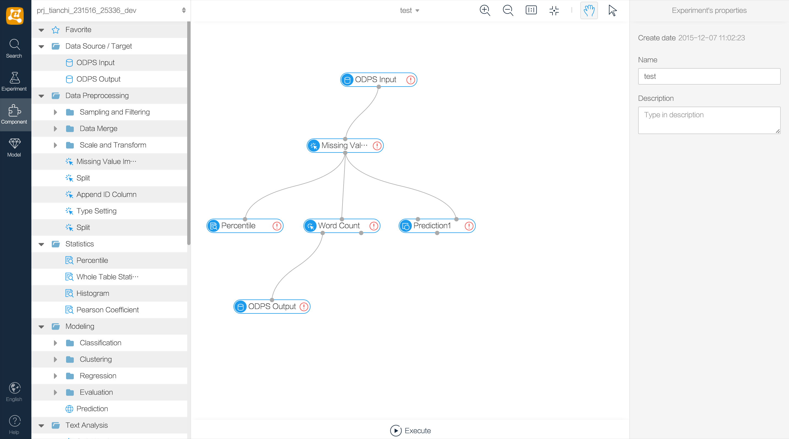
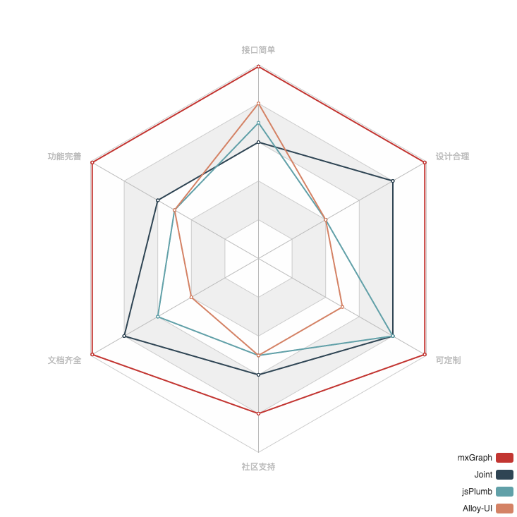

# 前端可视化建模技术概览

## 前言

建模是计算机世界一个恒久的主题。根本的需求来源于“图形化展示数据、逻辑”。这个需求下我们有了ER图、流程图、UML图、BPMN图等标准，也诞生了很多经典的桌面图形建模应用，譬如[visio][visio]、[Rational Rose][rational-rose]、[yEd][yed]、[XMind][xmind]等等。

单页面应用已经不是新鲜词汇，而利用html5开发离线应用、native应用的技术方案也越来越流行。因而在前端做类似的可视化建模的需求和解决方案也越来越多。举个离我们比较近的例子：ACP里就用到流程图表示工作流程和状态。

```viz-dot
digraph validatingFlow {
  rankdir="LR";
  a[label="开始"];
  b[label="审批中"];
  c[label="已审批"];
  d[label="已配置"];
  e[label="结束"];
  a->b
  b->c
  c->d
  d->e
}
```

当然，具体产品线里有更复杂的例子。譬如我们团队的[PAI][pai]使用DAG来描述数据挖掘的过程。



下面和大家分享一下前端可视化建模方面的需求和技术方案。

## 需求

可视化建模最核心的需求就是画一个图形学上的[图][wiki-graph]。要么是根据用户给定的数据结构展示成可视化的图形（用svg、canvas、html+css或者混用）；要么是经过用户和系统的一系列交互，画出可视化图形后，可以生成相应的数据结构。

即实现如下图的可视化建模系统。

```viz-dot
digraph modeling {
  labelloc="t"
  label="前端可视化建模系统"
  
  a[label="数据结构"];
  b[label="可视化图形"];
  c[label="用户交互"];
  
  a -> b [label="渲染"];
  b -> c
  b -> a [label="转换"];
  c -> b
}
```

## 分析

### 图素

上面的“前端可视化建模系统”就是一个典型的可视化图形。这个最最基础的图里包含以下基本图素：

* 顶点(node/vertex)
* 边(link/edge)

顶点表示描述的实体，边表示实体之间的关联。通过顶点和边的组合，就可以形成一个有意义的模型（图）。

从前端实现上可能还要抽象出来三个基本的要素：

* 画布(canvas/graph)
* 标签(label)
* 连接桩(port)

### 渲染工具

前面提过，前端做可视化图形可以用svg、canvas、html+css或者混用。其中，svg（或者混用html）是在这个可视化细分领域最常用的技术。因为svg里的Shapes刚好对应图里的顶点，而Paths可以对应图里的边。从实现上，svg里也有g元素可以实现画布、分组；text元素可以实现标签。甚至可以通过foreignObject内嵌html来实现复杂的顶点样式定制。事实上，上文的图正是用svg画出来的。目前应用svg实现前端建模的产品、框架很多，譬如：

* [IBM的开源项目Node-RED][node-red]
* [图形布局库dagre-d3][dagre-d3]
* [图形布局库cola.js][cola-js]
* [开源画图库Joint][joint]
* [开源画图库jsPlumb][jsPlumb]
* [开源框架AlloyUI的画图工具][alloy-ui-diagramming]
* [商业画图库mxGraph][mxGraph]
* [商业画图库Draw2D][draw2d]
* [微软的机器学习平台上的建模工具Azure-ML][azure-ml]

使用canvas的相对少一些，比较出名的有:

* [GoJS][gojs]
* [JS Graph][js-graph]
* [Springy][springy]

## 技术方案

如果只使用最基础的svg、canvas，不借助画图库的情况下，实现可视化建模是一件相当复杂的事情。这就是为什么上述列举的前端建模产品或者工具库除了Node-RED和AlloyUI暂未商业化以外，要么是闭源的（Azure-ML/mxGraph/Draw2D/GoJS/JS Graph），要么只是某个商用协议产品的社区开源版（Joint/jsPlumb），要么已经不维护了（dagre-d3）。

下面介绍几个在实现可视化建模时可供使用或者借鉴的项目。

### mxGraph

这个商业产品是上述提到的可视化建模产品里最强大的一个。从05年立项至今，这个库开发时间已有十年。而它的前身JGraph立项时间更早，是2000年。虽然开发模式落后（还是绑定全局变量的方式）、体积庞大，但mxGraph的设计、功能、文档各个方面都难以挑剔。前端可视化建模的标杆作品[draw.io][draw-io]以及中文作图社区[ProcessOn][process-on]都是基于这个库的。基本上目前mxGraph能做到的，就是前端可视化建模能做到的。

[demo: folding](https://jgraph.github.io/mxgraph/javascript/examples/folding.html)。

### Joint

Joint用jQuery维护dom，用lodash辅助计算以及渲染模版，用Backbone的Model和Events定义实体和暴露接口，并且自己实现了一套SVG渲染引擎。算得上是组合型的库。对Backbone比较熟悉的同学使用Joint上手会比较快。Joint自定义节点（使用模版）非常方便，动画相关的功能也很强大。另外，Joint还可以和布局库dagre配合使用，实现自动布局。

相比起mxGraph而言，Joint有几个设计或者实现上的问题：

1. 兼容性做得不够，IE9-不支持，并且在firefox低版本上有些问题
2. 连接桩（port）是作为节点（node）的附属，要实现深层定制比较麻烦
3. 没有做图层管理，节点的上下关系只能通过渲染顺序来决定
4. 常用的缩放、画布拖拽、自动布局、交互式画图等功能都没有内置，需要自行编写（除非使用商业版）

Joint作为rapid的社区版（开源版本）功能并不全面，很多时候要真正应用在项目里需要进行深入的定制。另外，其维护者对github上的issue响应速度很慢，有时候bug report也没有回应。

即便如此，Joint也算是可视化建模的开源库里最灵活、设计最优秀的库了。

[demo: petri nets](http://www.jointjs.com/demos/pn)。

### jsPlumb

jsPlumb采用的是svg和html混排的做法，把所有节点都是html，所有连线都是单独的svg节点包裹的path元素。这么做的好处是主要是可以兼容低版本浏览器，并且节点可以充分利用css进行定制。缺点也很明显，首先文档结构散乱，很难导出、转换，其次画出来的图总有莫名的违和感，感觉是像素图形和矢量图形生硬地放到了一起，再次，一旦css在js之后加载完成，jsPlumb的图就崩溃了，而jsPlumb的css也是有侵入性的。

[demo: state machine](https://jsplumbtoolkit.com/community/demo/statemachine/index.html)。

### Alloy-UI diagrams-builder

这个建模工具只建议在技术栈为YUI、并且建模需求简单时选用。Alloy-UI的设计和jsPlumb差不多，都是svg和html混排的形式。

## 总结

### 常用前端可视化建模工具对比



以上雷达图对比的是比较成规模的，可以独立完成可视化建模的工具库。

### 选型建议

具体做技术选型时有这几个建议：

* 个人项目可以尝试优秀的商业解决方案，体会这些强大的产品的设计
* 如果只有简单的模型展示功能，建议选用dagre-d3、Springy这样的，带自动布局、带渲染器的简单方案
* 如果有交互式建模的需求，但又不求深入定制，那可以根据开发者熟悉的技术栈选择Joint/jsPlumb/Alloy-UI等方案之一
* 如果有深入定制建模工具的需求，而且预算充足，建议和[ProcessOn][process-on]一样，选择mxGraph。如果同等条件又偏好canvas，则可以考虑[GoJS][gojs]
* 有深入定制建模工具的需求，又不允许使用商业产品，那么只剩下以下选择
  * 基于Joint做二次开发
  * 基于D3、raphael、svg.nap等实现一个可视化建模工具
  * 从0开始，实现一个可视化建模工具

[alloy-ui-diagramming]: https://github.com/liferay/alloy-ui/tree/master/src/aui-diagram-builder
[azure-ml]: https://studio.azureml.net
[cola-js]: http://marvl.infotech.monash.edu/webcola/
[dagre-d3]: https://github.com/cpettitt/dagre-d3
[draw-io]: http://draw.io
[draw2d]: http://www.draw2d.org/draw2d/home/index.html
[gojs]: http://www.nwoods.com/products/gojs/index.html
[joint]: https://github.com/clientIO/joint
[js-graph]: http://www.js-graph.com/
[jsPlumb]: https://github.com/sporritt/jsPlumb
[mxGraph]: http://www.jgraph.com/javascript-graph-visualization-library.html
[node-red]: http://nodered.org/
[pai]: http://pai.yushanfang.com/
[process-on]: https://www.processon.com/diagrams
[rational-rose]: http://www.ibm.com/software/products/en/ratirosefami/
[springy]: http://getspringy.com/
[visio]: http://www.microsoftstore.com.cn/%E7%B1%BB%E5%88%AB/%E8%BD%AF%E4%BB%B6%E4%B8%8E%E6%9C%8D%E5%8A%A1/c/software
[wiki-graph]: https://en.wikipedia.org/wiki/Graph_(abstract_data_type)
[xmind]: http://www.xmind.net/
[yed]: http://www.yworks.com/products/yed
