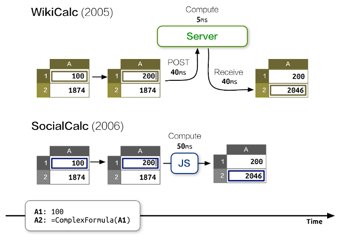
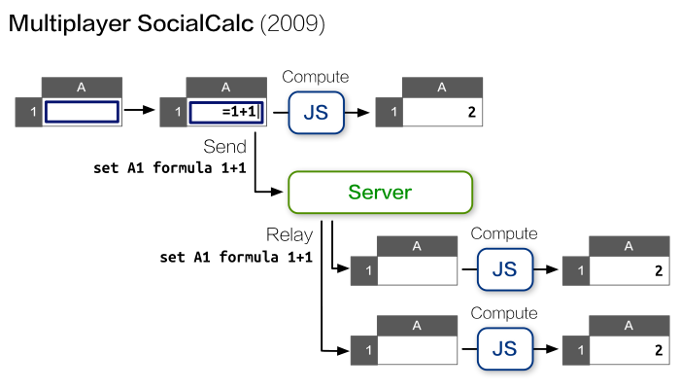
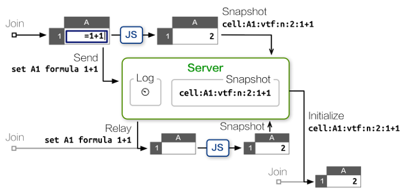
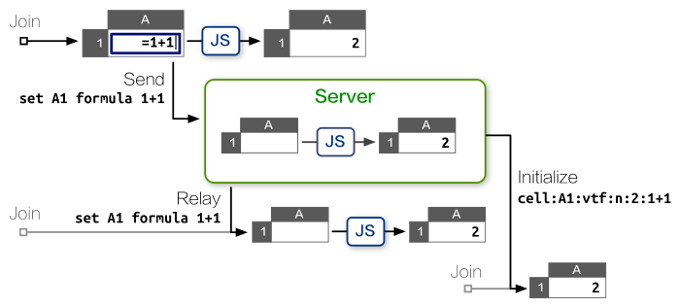
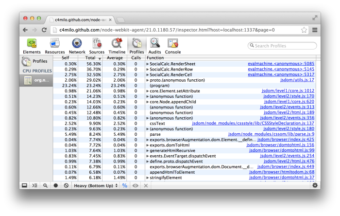
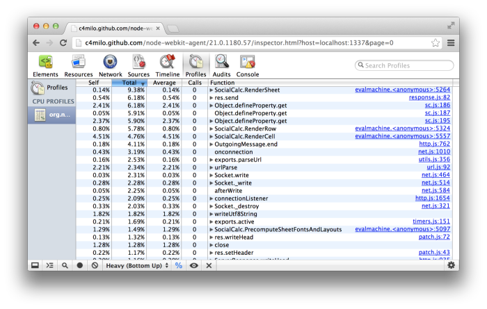
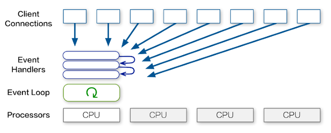
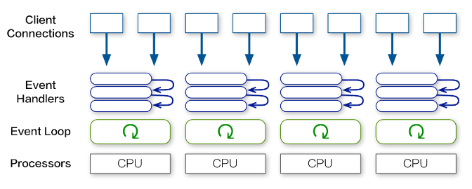
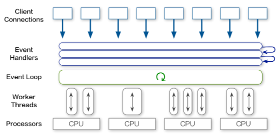

# 从SocialCalc到EtherCalc

[EtherCalc](https://ethercalc.net/)是一个在线电子表格系统，它专注于在线协作编辑，使用SocialCalc作为浏览器端的电子表格引擎。SocialCalc由Dan Bricklin（电子表格的发明人）设计，是Socialtext平台的一部分。Socialtext是面向商业用户的协同工作平台。

对Socialtext团队而言，2006年开发SocialCalc的主要目标是性能。主要的考虑是，虽然客户端的JavaScript运算会比服务器端的Perl运算慢一个量级，但总体而言所消耗的时间会比AJAX往返所需的网络延迟要少得多。



SocialCalc把所有运算都放到浏览器上进行，服务器存在的意义仅仅是加载和保存电子表格。在[开源应用架构](http://aosabook.org/en/index.html)最后一章的[SocialCalc](http://blog.leungwensen.com/2016/socialcalc.md)部分，我们介绍了如何基于简单的、类聊天室的架构来实现电子表格的多人协作编辑。



不过，当我们开始在生产环境中测试时，我们发现这个系统有些性能和扩展性上的不足，这驱使我们对系统进行了一些重构以获得可接受的性能。在本文，我们会阐明如何实现新的架构，如何使用性能测试工具，以及如何实现新的工具以解决性能问题。


## 设计约束

Socialtext平台同时有着带防火墙部署和云端部署的特性，这使得EtherCalc在资源和性能要求方面有着独特的约束。

在编写本文的时间节点，Socialtext基于VMWare的vSphere内部部署时，需要双核CPU和4GB内存。云端部署时，一个典型的Amazon EC2实例大概会提供上述配置的两倍，也就是4核CPU和7.5GB内存。

带防火墙部署意味着我们不能像多租户的托管系统（譬如DocVerse，后来是Google Docs的一部分）一样，把问题抛给硬件。我们只能承担一定量的服务器容量。

相比起内部部署，云端实例提供更好的容量和按需扩展特性，但通常网络连接会更慢，并且因为频繁的断开连接和重连接会困扰用户。

因此，下述资源约束影响了EtherCalc的架构设计：

### 内存

基于事件的服务器使得我们可以用很小的内存承载成千上万的并发连接。

### CPU

遵循SocialCalc的原始设计，我们把大部分的运算和内容渲染都移交客户端JavaScript。

### 网络

通过只传输操作信息，而不传输电子表格内容，我们大幅削减了带宽占用，并且提供在不稳定网络连接下的恢复功能。


## 最初原型

一开始我们通过[Feersum](https://metacpan.org/release/Feersum)用Perl 5实现了一个WebSocket服务器。Freesum是Socialtext开发的一个基于[libev](http://software.schmorp.de/pkg/libev.html)的非阻塞网络服务器。它非常快，能用单个CPU提供10,000连接每秒的并发能力。在Freesum上，我们使用[PocketIO](https://metacpan.org/release/PocketIO)中间件来响应JavaScript的Socket.io客户端。Socket.io能在不支持WebSocket的浏览器上提供向后兼容。

最初的原型酷似聊天服务器。每一个协作会话都是一个聊天室，客户端会把本地执行的命令和光标位置移动发送到服务器，服务器会把这些信息同步到同一个聊天室里的所有客户端。

下图描述了一个典型的操作流程。



这个方案解决了新客户端加入带来的CPU损耗问题，但带来了网络性能的问题，因为它依靠每个客户端上行的带宽。如果网络连接比较慢，会影响客户端后续上传的命令。

另外，这个方案下服务器也不能检查从客户端上传的快照的一致性。因此出错或者恶意的快照将会影响所有新加入的客户端，使得新客户端不能和已有的客户端状态同步。

聪明的读者这时应该能看出来，这两个问题都是因为服务器无法执行电子表格命令造成的。如果服务器能根据接收到的命令更新自己的状态，那它甚至不需要维护一个命令的日志备份。

浏览器中的SocialCalc引擎是用JavaScript编写的，我们曾尝试把这套逻辑转译到Perl中去，但这样做会带来维护两份代码的成本。我们也尝试过嵌入JS引擎（[V8](https://metacpan.org/release/JavaScript-V8)，[SpiderMonkey](https://metacpan.org/release/JavaScript-SpiderMonkey)），但在Feersum的事件循环之上运行时，会带来新的性能问题。

最终，在2011年8月，我们决定用Node.js重写服务器。

## 移植到Node.js

最初的重写比较顺利，因为Feersum和Node.js都基于同样的libev事件模型，并且PocketIO的API和Socket.io非常相近。我们只花了一个下午的时间，写了80行代码就得到了一个功能相当的服务器。这里感谢[ZappaJS](http://zappajs.com/)提供的简洁的API。

最初的[微型性能评估](http://c9s.github.com/BenchmarkTest/)显示，移植到Node.js后我们大约损失了最大吞吐量的一半。在2011年一个典型的因特尔i5内核CPU上，原来基于Feersum的方案每秒能处理5000个请求，而Node.js的Express每秒最多只能处理2800个。

这个性能损失在第一版JavaScript实现上我们是可以接受的，因为这个方案并不会很显著地提高用户操作延迟，并且我们确信它的性能会随着时间推移而上升。

接下来，我们继续减少客户端的CPU占用，并且通过用服务器版本的SocialCalc电子表格跟踪每个会话的状态来最小化带宽占用。




## 服务器版的SocialCalc

解决问题的关键技术是[jsdom](https://github.com/tmpvar/jsdom)，一个W3C文档对象模型的完全实现，它令Node.js可以在模拟的浏览器环境中加载客户端JavaScript库。

使用了jsdom之后，我们可以随意创建任意数目的服务器端SocialCalc电子表格，每个表格隔离在单独的沙盒里，只占去大约30KB的内存：

```javascript
require! <[ vm jsdom ]>
create-spreadsheet = ->
  document = jsdom.jsdom \<html><body/></html>
  sandbox  = vm.createContext window: document.createWindow! <<< {
    setTimeout, clearTimeout, alert: console.log
  }
  vm.runInContext """
    #packed-SocialCalc-js-code
    window.ss = new SocialCalc.SpreadsheetControl
  """ sandbox
```

每个协作会话对应一个沙盒中的SocialCalc控制器，在上面执行所有获取的命令。然后服务器会把这个控制器的状态广播给所有新加入的客户端，顺带完全消除了记录操作日志的必要。

因为对性能评估结果很满意，我们开发了一个基于Redis的持久化层，然后对外发布了[EtherCalc.org](http://ethercalc.org/)公开测试版本。接下来的六个月内，它一直保持着良好的可扩展性，零故障完美地处理了百万级别的电子表格操作。

在2012年4月，在OSDC.tw会议上分享了EtherCalc后，我受Trend Micro邀请参加了他们的黑客马拉松，把EtherCalc改造成他们实时网络流量监控系统的可编程的可视化引擎。

针对他们的需求，我们创建了REST API，用于支持对单个单元格的GET／PUT操作，以及直接对电子表格实例本身POST操作命令。在黑客马拉松期间，新上线的REST处理模块每秒接受几百次调用，在感受不到延迟或者内存溢出的情况下在浏览器中更新着图表和公式单元格的内容。

不过，在最后一天的demo里，当我们把流量数据传入EtherCalc并在浏览器电子表格中输入公式后，服务器忽然锁死，冻结了所有活跃的连接。我们重启了Node.js进程，但很快服务器仍然用掉了100%CPU，并且锁死。

我们被吓坏了，赶紧换用更小的数据集，然后系统终于正确运行，最终我们顺利完成demo。不过我想知道的是，到底是什么导致了服务器死锁？


## Node.js性能探查

为了弄清楚CPU资源的去向，我们需要一个性能探查工具。

得益于卓绝的[NYTProf](https://metacpan.org/module/Devel::NYTProf)探查工具，对最初的Perl原型做性能探查非常直观，能看到每个函数、每一行、每个操作码和每个代码块的执行时间信息，并带有[调用栈的可视化图表](https://metacpan.org/module/nytprofcg)和HTML报告。配合NYTProf，我们还使用Perl内置的[DTrace支持](https://metacpan.org/module/perldtrace)，跟踪长时间运行的进程，实时捕获开始和结束函数调用的统计信息。

相比而言，Node.js的性能探查工具可谓差强人意。直到编辑本文时，DTrace支持还局限于[基于illumos系统](https://nodejs.org/en/blog/uncategorized/profiling-node-js/)的32位模式。因此我们大多数情况下使用[Node Webkit Agent](https://github.com/c4milo/node-webkit-agent)，尽管它只提供函数级别的统计信息，但有一个可以访问的探查界面。

一个典型的探查会话如下：

```shell
# "lsc"是LiveScript编译器
# 加载WebKit agent, 然后运行app.js:
lsc -r webkit-devtools-agent -er ./app.js
# 在另一个terminal标签页，启动探查工具:
killall -USR2 node
# 在Webkit内核的浏览器打开这个URL，开始探查:
open http://tinyurl.com/node0-8-agent
```

为重现重后台负荷，我们用Apache的性能评估工具[ab](http://httpd.apache.org/docs/trunk/programs/ab.html)模拟了高并发的REST API调用。为模拟浏览器端操作，譬如移动光标、更新公式等，我们使用[Zombie.js](http://zombie.labnotes.org/)，并且用jsdom和Node.js构建了一个无头浏览器。

讽刺的是，我们最后发现性能的瓶颈在jsdom本身。



从图2.5可以看到，占用CPU资源最多的是`RenderSheet`。每次服务器接到一个命令，就要花几毫秒的时间去重回单元格中的`innerHTML`，从而展现每个命令的执行结果。

因为所有jsdom代码都在单独的线程中执行，后续的REST API调用就会阻塞到前一个命令渲染完成。在高并发的场景下，巨大的等待队列就触发了潜在的bug，从而造成服务器死锁。

我们检查堆占用后发现，所有渲染结果都没有被引用，因为我们本来就不需要在服务器端实时展示HTML。唯一会访问到这些渲染结果的是HTML导出API，而这个场景我们也可以通过内存中的电子表格结构随时重现每个单元格的`innerHTML`。

为此，我们把`RenderSheet`函数中的jsdom移除了，取而代之的是一个最小化的[只用liveScript20行代码实现](https://github.com/audreyt/ethercalc/commit/fc62c0eb#L1R97)的DOM，用于支持HTML导出。然后我们重新运行了性能探查工具（见图2.6）。



改进非常明显！吞吐量提高了4倍，HTML导出快了20倍，并且服务器再也没有出现死锁。


## 多核扩展

经过这次改进，我们终于敢于把EtherCalc整合到Socialtext平台中去，支持wiki页面和电子表格风格的多人协作编辑。

为保证生产环境的响应时间，我们部署了反向代理的nginx服务器，利用它的`limit_req`指令提高API调用的并发数目。这个技术在带防火墙部署和专用实例部署场景下的表现都令人满意。

Socialtext为中小商业客户准备了第三种部署方式，那就是多租户托管。一个独立的大的服务器上支持着35,000个公司，每个公司平均100个左右的用户。

在多租户的场景，所有客户在调用REST API时都有着同样的速率限制。这就使得每个客户端都存在每秒大约5个请求的并发约束。之前一节提到过，这个限制的存在是因为Node.js的所有运算只用到了单个CPU。



有没有办法利用上多租户服务器上所有的备用CPU？

对于其它在多核服务器上的Node.js服务，我们利用预分叉的[cluster服务器](https://www.npmjs.com/package/cluster-server)在每个CPU上创建一个进程。



然而EtherCalc本身已经因为Redis而具备了多服务器扩展能力，如果在单台服务器上实现[Socket.io](https://github.com/socketio/socket.io)集群和[RedisStore](http://stackoverflow.com/questions/5739357/how-to-reuse-redis-connection-in-socket-io/5749667#5749667)，这会大大增加逻辑复杂性，并使得调试更加困难。

另外，如果所有集群中的进程都绑定到CPU处理，后续的连接还是会被阻塞。

我们并没有采取预分叉固定数目的进程，而是寻求创建一个后台线程、然后把执行命令的工作分配到所有CPU核心上的办法。



针对我们的目标，W3C的[Web Worker](http://www.w3.org/TR/workers/)API是一个完美的解决方案。它是为浏览器设计的，定义了在后台独立执行脚本的方法。这就使得费时的任务可以持续执行，而不影响主线程的响应。

因此我们创建了[webworker-threads](https://github.com/audreyt/node-webworker-threads)项目，在Node.js上实现了跨平台的Web Worker API。

使用webworker-threads，创建新的SocialCalc线程以及线程间通信变得非常直观：

```javascript
{ Worker } = require \webworker-threads
w = new Worker \packed-SocialCalc.js
w.onmessage = (event) -> ...
w.postMessage command
```

这个方案可谓两全其美：既可以按需为EtherCalc增加CPU，又把占用资源极少的后台进程保持在单CPU环境下。


## 收获

### 带着枷锁好跳舞

Fred Brooks在他的著作*《设计原本》*中说到，约束可以压缩设计者的检索空间，从而帮助他专注下来、加速设计进程。这其中包括自我强加的约束：

> 在设计任务中的人为约束有很好的特质，就是我们可以自由地解除。理想情况下，这些约束可以把人驱驰到设计领域的处女地，提高人的创造力。

在EtherCalc的开发中，这样的人为约束非常关键，可以帮助EtherCalc在几次迭代后保持*概念完整性*。

举个例子，一个看上去可行的方案是，我们可以为三种服务器类型（带防火墙，云端，多租户托管）实现三种不同的并发架构。然而，这样的过早优化会严重影响系统的概念完整性。

相反，我专注于让EtherCalc可以在各种资源需求下都能有不错的性能。因此优化CPU使用、降低内存占用和减少带宽占用是同时进行的。带来的结果就是，因为内存占用在100MB以下，我们甚至可以在类似Raspberry Pi这样的嵌入式平台下部署EtherCalc。

这个人为约束最终使得EtherCalc可以部署在所有三种资源都受限制的PaaS环境下（譬如DotCloud，Nodejitsu和Heroku）。人们甚至可以很容易搭建一个个人的电子表格服务，从而鼓励了更多独立集成商参与贡献。

### 最差的就是最好的

在2006年芝加哥的YAPC::NA会议上，我受邀对开源世界的前景作出预测，这是我的[分享](http://pugs.blogs.com/pugs/2006/06/my_yapcna_light.html)：

> 我不能证明这一点，但我觉得明年JavaScript 2.0就可以实现自举，完成自托管，编译成JavaScript 1，并且取代Ruby成为所有环境下的下一匹黑马。

> 我觉得CPAN和JSAN将会合并，JavaScript会成为所有动态语言通用的后端，这样你可以写Perl代码，然后在浏览器执行，在服务器运行，在数据库里运行，而只需要准备一套开发工具。

> 因为，我们都知道，*更差的就是更好的*，因此*最差的*脚本语言注定成为*最好*的。

这个观点在2009年附近随着接近机器指令速度的JavaScript引擎的到来而变为现实。在编写本文时，JavaScript已经成为一个“*一次编写，到处运行*”的虚拟机－所有其它的主流语言都可以编译成JavaScript，并且[几乎没有性能损耗](http://asmjs.org/)。

除了客户端有浏览器、服务器端有Node.js，JavaScript还在[进军](http://pgre.st/)Postgres数据库，享用着数目巨大的可以在所有这些运行环境中重用的[模块仓库](https://npmjs.org/)。

是什么使得社区成长如此迅猛？从EtherCalc的开发过程中，从初始阶段开始参与NPM社区的过程中的经验来看，我猜想恰恰是因为JavaScript约束很少，并且可以为不同的使用目的定制语言，从而让创新者可以专注于方言和工具本身（譬如jQuery和Node.js），每个团队都可以从一个通用的语言核心中抽象出他们自己的*语言精髓*。

新用户可以从一个非常精炼的自己入手，经验丰富的开发者则可以挑战已有系统的更好实现。JavaScript的草根开发方式并不依赖某个核心设计团队为大家设计好完整的语言层面的方案来满足所有可预期的需求，而用实际行动践行着Richard P. Gabriel著名的“[更差的就是更好的]”这句格言。

### LiveScript，趋于极致

相比起Perl风格的[Coro::AnyEvent](https://metacpan.org/module/Coro::AnyEvent)，基于回调的Node.js API依赖深层回调，从而难以复用。

在尝试了几个流控制库之后，我最终通过选用[LiveScript](http://livescript.net/)解决了这个问题。它是一门新的、编译到JavaScript的语言，其语法深受Haskell和Perl的启发。

事实上EtherCalc的实现带有4门语言的血统：JavaScript, CoffeeScript, Coco和LiveScript。每次迭代都带来更强的表现力，非常感谢[js2coffee](http://js2coffee.org/)和[js2ls](http://js2ls.org/)项目为我们维护充分的向前和向后兼容性。

因为LiveScript并不会解释成自己的二进制代码，而是编译成JavaScript，它对支持函数作用域的性能探查工具很友好。它产生的代码和手写的JavaScript一样强大，可以充分利用现代的原生JavaScript运行时。

在语法上，LiveScript用小说的结构替代回调，譬如[backcalls](http://livescript.net/#backcalls)和[cascades](http://livescript.net/#cascades)。它还从语法上提供了书写函数式或者面向对象代码的强大工具。

我刚接触LiveScript时，我觉得它像是“Perl 6的一个小方言，挣扎着要脱颖而出”。LiveScript的目标实现得如此简单，因为它采用了和JavaScript相同的语义，并且严格专注于改善语法本身。

### 总结

和SocialCalc设计良好的标准和开发流程不同，EtherCalc从2011年中到2012年底基本上是一个独立的实验产品，并支持了从评估Node.js可用性到生产环境部署的各种使用场景。

这份没有约束的自由给我提供了尝试各种语言、库、算法和架构的令人振奋的机会。我非常感谢所有的贡献者、合作者和集成商，特别感谢Dan Bricklin和Socialtext的同事们对我试验这些技术的鼓励。多谢大家！


## 文档信息

项目 | 内容
---- | ----
原文链接 | [http://aosabook.org/en/posa/from-socialcalc-to-ethercalc.html](http://aosabook.org/en/posa/from-socialcalc-to-ethercalc.html)
原文作者 | [Audrey Tang](https://github.com/audreyt)
本文链接 | [http://blog.leungwensen.com/2016/from-socialcalc-to-ethercalc.md](http://blog.leungwensen.com/2016/from-socialcalc-to-ethercalc.md)
相关文档 | [SocialCalc(译文)](http://blog.leungwensen.com/2016/socialcalc.md)


如果发现翻译问题，欢迎反馈：[leungwensen@gmail.com](mailto:leungwensen@gmail.com)

