# SocialCalc

电子表格（spreadsheets）的历史已经超过30年。第一个电子表格软件[VisiCalc](https://en.wikipedia.org/wiki/VisiCalc)由[Dan Bricklin](http://danbricklin.com/)于1978年设计，并于1979年问世。其原始理念非常直截了当：就是一个可以向两个维度无限延展的表格，表格中的每一个单元格可以由文字、数字或者公式组成。公式可以是运算符或者一些内置函数的组合，并且每一个公式都可以访问到其它单元格的当前值。

虽然这个概念非常简单，但它有着非常广泛的应用场景：会计、库存清点、编目管理等只是其中少数的几个。它可以做的事情几乎是无限的。这些用途使得VisiCalc成为个人电脑时代的“杀手级应用“。

在接下来的数十年里，VisiCalc的继承者[Lotus 1-2-3](https://en.wikipedia.org/wiki/Lotus_1-2-3)和[Excel](https://en.wikipedia.org/wiki/Microsoft_Excel)等做了大量的增量改进。但其核心理念并没有改变。绝大多数的电子表格都保存为物理磁盘上的文件，打开编辑的时候会被加载到内存中。基于这样的文件模型，合作编辑非常困难：

* 每个用户都需要安装特定版本的电子表格编辑器
* 无论是通过邮件、共享文件夹还是设置专用的版本管理仓库来分享文件，都增加了额外的开销
* 变更跟踪功能非常有限，譬如Excel并不会保留格式变更和单元格评注的历史
* 如果变更了模版中的格式或者公式，那么对应用了该模版的电子表格文件的修改将非常麻烦

幸运的是，已经存在一个优雅而简单的能解决这些问题的新协作模型。就是[Ward Cunningham](https://en.wikipedia.org/wiki/Ward_Cunningham)在1994年发明、并因Wikipedia在2000年的普及而流行起来的[wiki模型](https://en.wikipedia.org/wiki/Wiki)。

wiki模型并不保存文件，而是通过服务器维护页面，并允许用户在不安装额外软件的前提下通过浏览器编辑这些页面。这些富文本页面相互之间可以简单链接，更可以通过组合其它页面的某些部分来构建更大的页面。所有参与者默认都浏览和编辑最新的版本，而服务器会自动管理版本历史。

Dan Bricklin受到wiki模型的启发，在2005年开始投入[WikiCalc](https://en.wikipedia.org/wiki/WikiCalc)的开发。这个项目旨在结合wiki的易于编辑、可多人协作的特性，以及人们熟悉的电子表格可视的格式化和计算的理念。


## 19.1. WikiCalc

第一版本的WikiCalc(图19.1)拥有与众不同的一下几个特性：

* 文本数据可以是纯文本，HTML或者wiki样式的markup文本
* wiki样式的文本支持插入链接、图片以及其它单元格的引用
* 公式单元格可以引用其它网站上的WikiCalc页面的值
* 能创建嵌入网页的输出，并支持静态输出和动态数据输出
* 可以通过CSS属性和CSS类来格式化单元格
* 跟踪所有编辑操作记录
* 想wiki一样，保留所有版本并支持版本回滚

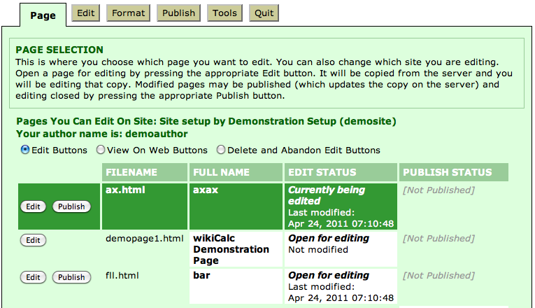

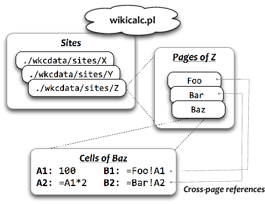

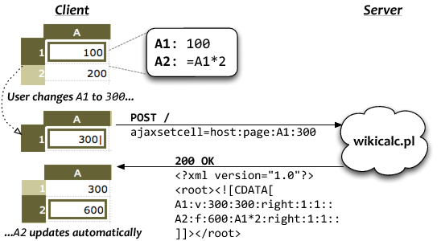

WikiCalc 1.0的内部架构(图19.2)以及消息流(图19.3)故意设计得非常简单，但却非常强大。其中，允许组合小的电子表格构成大电子表格这一功能尤其有用。举个例子，设想有一群销售员把销售数据存到电子表格中，那么销售经理就可以汇总他手下销售员的数据而形成一个区域性的电子表格，接下来销售副总裁就可以汇总所有数据构成一个顶级的电子表格了。

每次单个电子表格更新的时候，组合表格都可以同步反映出来。如果有人对细节数据感兴趣，他只需要点击跳转到当前电子表格所汇总的小的电子表格上。这个组合功能消除了异地更新数据带来的冗余和易错性，并且使得所有电子表格上展示的数据保持最新。

为使得所有重新计算保持最新，WikiCalc采取了弱客户端的设计，把所有的状态信息都保存到服务器端。每个电子表格都以`<table>`元素的形式展示在浏览器上，编辑单元格时会向服务器端发起`ajaxsetcell`调用，然后服务器会通知浏览器更新哪些单元格。

很明显，这个设计依赖浏览器和服务器之间的快速连接。一旦网络延迟，用户会在更新单元格到看到更新内容的间隙频繁地看到“加载中...”这样的消息，如图19.4。当用户编辑公式时调整输入并希望实时看到结果时，这个问题尤为突出。

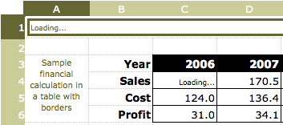

另外，由于`<table>`元素和电子表格的维度一致，一个100x100的坐标方格会创建10,000个`<td>`DOM对象，从而会占用了大量浏览器内存，进而限制了页面的大小。

因为存在这些问题，WikiCalc虽然作为单机服务器运行在本地时非常有用，但要作为基于网络的内容管理系统就显得不切实际了。

2006年，Dan Bricklin和[Socialtext](https://en.wikipedia.org/wiki/Socialtext)合作，基于某些WikiCalc原来的Perl代码，用JavaScript完全重写这个系统，也就是[SocialCalc](https://github.com/DanBricklin/socialcalc)这个项目。

这次重写旨在提供大规模、分布式的协作方案，并尽力提供接近桌面应用的外观和体验。其它的设计目标包括：

* 能处理成千上万的单元格
* 快速的编辑响应
* 基于客户端的编辑记录跟踪和撤销／重做栈
* 更好地利用JavaScript和CSS以提供成熟的布局功能
* 更广泛应用JavaScript的同时提供跨浏览器支持

经过3年的开发和几次测试版本发布，Socialtext在2009年发布了SocialCalc 1.0，达成了所有设计目标。下面我们看看SocialCalc系统的架构。

## 19.2. SocialCalc

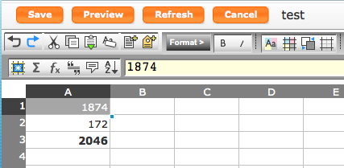

图19.5和图19.6分别展示了SocialCalc的界面和类图。相比起WikiCalc，起服务器的角色大为削弱。服务器的职责只剩下响应HTTP GET请求，以序列化保存的格式返回整个电子表格，一旦浏览器拿到数据，所有的计算、变更跟踪、用户交互都交由JavaScript接管。

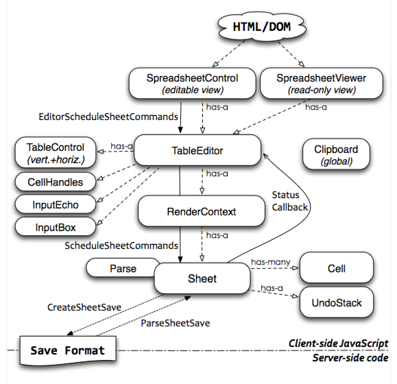

这些JavaScript组件依照MVC(Model/View/Controller)风格进行分层，每个类都只专注于单个方面：

* Sheet是数据模型，是电子表格在内存中的数据结构映射。其中包括一个由坐标指向Cell对象的字典，用于表示每一个单元格。空单元格没有对应的实例，也就不占用任何内存
* Cell表示每个单元格的内容和格式。表19.1展示了一些常用的属性。
* RenderContext是视图(view)的实现，负责把一个sheet(也就是Sheet的实例)渲染成DOM对象。
* TableControl是主控制器(controller)，接收鼠标键盘事件。如果它接收到视图事件，譬如滚屏或者缩放，它会更新它所关联的RenderContext对象。如果它接收到影响sheet内容的更新事件，它会生成新的命令加入到sheet的命令队列中。
* SpreadSheetControl是顶级的UI模块，带有工具栏、状态栏、对话框和颜色选择器具等。
* SpreadSheetViewer类似于SpreadSheetControl，但只提供只读的交互视图。

表19.1 单元格内容和格式

属性 | 值
---- | ----
`datatype` | `t`
`datavalue` | `1Q84`
`color` | `black`
`bgcolor` | `white`
`font` | `italic bold 12pt Ubuntu`
`comment` | `Ichi-Kyu-Hachi-Yon`

其内部采取了一个最小实现的基于类的对象系统，提供简单的组合和委派功能，而不采用继承或者对象原型等方案。所有接口都直接放置到`SocialCalc.*`命名空间下，避免命名冲突。

sheet的更新都通过`ScheduleSheetCommands`这个方法，这个方法根据输入的命令字符串对电子表格作出相应的编辑。(表19.2展示了一些常用的命令)嵌入SocialCalc的应用可以通过往`SocialCalc.SheetCommandInfo.CmdExtensionCallbacks`对象添加回调函数的形式来增加额外的命令，并且使用`startcmdextension`命令来调用。

表19.2 SocialCalc命令

```
    set     sheet defaultcolor blue
    set     A width 100
    set     A1 value n 42
    set     A2 text t Hello
    set     A3 formula A1*2
    set     A4 empty
    set     A5 bgcolor green
    merge   A1:B2
    unmerge A1
    erase   A2
    cut     A3
    paste   A4
    copy    A5
    sort    A1:B9 A up B down
    name    define Foo A1:A5
    name    desc   Foo Used in formulas like SUM(Foo)
    name    delete Foo
    startcmdextension UserDefined args
```

## 19.3. 命令执行流程

为提高响应速度，SocialCalc在后台执行所有的重新运算和DOM更新，这样用户可以在引擎处理之前命令队列里的编辑的同时，继续编辑其它单元格。

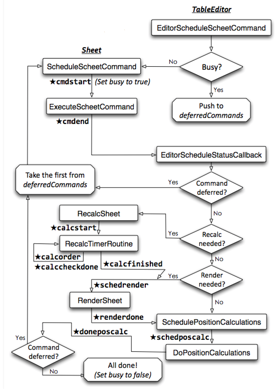

当有命令执行的时候，`TableEditor`对象会把`busy`标志设置为true，这时后续的命令会被压入`deferredCommands`队列，保证后续命令能按序执行。如图19.7的事件循环图所示，Sheet对象会在下列步骤中一直发起`StatusCallback`事件来通知用户命令的当前执行状态：

* ExecuteCommand: 开始时发送`cmdstart`，命令执行结束时发送`cmdend`。如果命令触发了单元格内容的变更，则进入Recalc步骤；如果命令变更了屏幕中1个或者多个单元格的外观，则进入Render步骤；如果以上两个都不符合(譬如`copy`命令)，则直接跳到PositionCalculations步骤。
* Recalc(按需): 开始时发送`calcstart`，检查单元格依赖链时每100毫秒发送一次`calcorder`，检查完成时发送`calccheckdone`，而在所有单元格都得到了重新计算的值后发送`calcfinished`。这一步结束后会跳到Render步骤。
* Render(按需): 开始时发送`schedrender`，而在`<table>`元素更新后发送`renderdone`。这一步结束后会跳到PositionCalculations步骤。
* PositionCalculations: 开始时发送`schedposcalc`，而在更新滚动条、当前编辑光标和`TableEditor`的其它可视模块后发送`doneposcalc`

因为所有命令在执行后都会保存，我们自然可以得到一个操作日志。`Sheet.CreateAuditString`方法会返回以换行符分割的操作日志的字符串，每一行就是一个命令。

`ExecuteSheetCommand`函数会同时生成被执行命令的撤销命令。举个例子，当单元格A1内容为“Foo”，用户执行`set A1 text Bar`时，撤销命令`set A1 text Foo`会被压入撤销栈。这时如果用户点击撤销，该撤销命令就会被执行，A1会恢复到原始值。

## 19.4. 表格编辑器

现在来看看TableEditor层。它会计算`RenderContext`在屏幕中的坐标，并且通过两个`TableControl`实例来控制水平／垂直方向的滚动条。

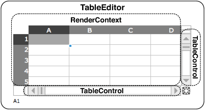

被`RenderContext`类处理的视图层，也和WikiCalc的设计有所不同。SocialCalc没有把每个单元格映射到一个`<td>`元素上，而是根据浏览器可视区域简单地创建一个`<table>`元素，并用`<td>`元素预填充。

当用户通过定制的滚动条滚动电子表格时，SocialCalc会动态地设置预填充的`<td>`元素的`innerHTML`。这意味着在大多数情况下，SocialCalc不会创建或者销毁任何`<tr>`或者`<td>`元素，这带来了极大的性能提升。

因为`RenderContext`只会渲染可视区域，所以无论Sheet对象有多大，也不会影响渲染性能。

`TableEditor`还包含一个`CellHandles`对象，用于在当前可编辑单元格右下方加入一个迳向的填充／移动／滑动菜单，也就是ECell，如图19.9所示。

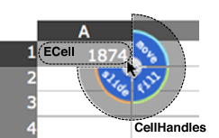

输入框由两个类管理：`InputBox`和`InputEcho`。前者管理表格上方的输入行，后者管理ECell内容上方输入即更新的预览层。(图19.10)


一般情况下，SocialCalc引擎只在打开电子表格或者保存电子表格的时候需要和服务器通信。因此有`Sheet.ParseSheetSave`方法用于把保存格式的字符串解释为`Sheet`对象，还有`Sheet.CreateSheetSave`方法把`Sheet`对象序列化为保存格式。

公式可以通过url访问任意远程的电子表格的值。`recalc`命令会重新获取引用的外部电子表格，用`Sheet.ParseSheetSave`解释，并保存到缓存中，这样用户下次可以在不请求文件的情况下引用这些电子表格。

## 19.5. 保存格式

电子表格的保存格式是[MIME标准](https://en.wikipedia.org/wiki/MIME)的`multipart/mixed`格式，包含4个`text/plain; charset=UTF-8`的部分，每部分都包含由换行符分割的文本，文本中的数据用冒号分割。这4个部分分别是：

* `meta`部分列举了其它部分的类型。
* `sheet`部分列举每个单元格的格式和内容，每个列的列宽(如果非默认)，sheet的默认格式，最后是sheet中用到的字体、颜色和边框等。
* 可选的`edit`部分保存了`TableEditor`的编辑状态，包括ECell的最后位置以及列／行的固定大小。
* 可选的`audit`部分，保存了上一次编辑会话里的操作历史。

举个例子，图19.11展示了一个有3个单元格的电子表格，内容为`1874`的A1为ECell，A2为公式`2^2*43`，A3为公式`SUM(Foo)`，并且用粗体渲染，其中`Foo`为`A1:A2`的范围。

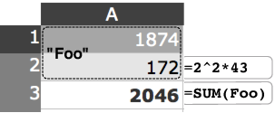

序列化后的保存格式如下：

```
    socialcalc:version:1.0
    MIME-Version: 1.0
    Content-Type: multipart/mixed; boundary=SocialCalcSpreadsheetControlSave
    --SocialCalcSpreadsheetControlSave
    Content-type: text/plain; charset=UTF-8

    # SocialCalc Spreadsheet Control Save
    version:1.0
    part:sheet
    part:edit
    part:audit
    --SocialCalcSpreadsheetControlSave
    Content-type: text/plain; charset=UTF-8

    version:1.5
    cell:A1:v:1874
    cell:A2:vtf:n:172:2^2*43
    cell:A3:vtf:n:2046:SUM(Foo):f:1
    sheet:c:1:r:3
    font:1:normal bold * *
    name:FOO::A1\cA2
    --SocialCalcSpreadsheetControlSave
    Content-type: text/plain; charset=UTF-8

    version:1.0
    rowpane:0:1:14
    colpane:0:1:16
    ecell:A1
    --SocialCalcSpreadsheetControlSave
    Content-type: text/plain; charset=UTF-8

    set A1 value n 1874
    set A2 formula 2^2*43
    name define Foo A1:A2
    set A3 formula SUM(Foo)
    --SocialCalcSpreadsheetControlSave--
```

这个格式的设计原则是易读，并且程序易处理。这种设计使得[Drupal公司的Sheetnode插件](https://www.drupal.org/project/sheetnode)可以很方便地使用PHP把这种格式和其它流行的电子表格格式进行互相转换，譬如Excel(.xls)和[OpenDocument](https://en.wikipedia.org/wiki/OpenDocument)(.ods)。

我们现在已经了解了SocialCalc系统的各个部分是如何相互协作的了。下面我们看两个扩展SocialCalc功能的实际例子。

## 19.6. 富文本编辑

第一个例子是为SocialCalc的表格编辑器加上wiki markup文本的编辑和渲染功能(图19.12)。

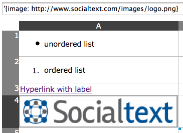

我们在SocialCalc发布1.0之后加上了这个功能，以满足用户用统一的语法插入图片、链接和markup文本的需求。Socialtext已经有了一个开源的wiki平台，因此我们在SocialCalc中也重用了这种语法。

为实现这个功能，我们需要定制`text-wiki`的`textvalueformat`的渲染器，并把默认的文本单元格格式转为这种格式。

什么是`textvalueformat`？下面会提到。

### 19.6.1. 类型和格式

在SocialCalc中，每一个单元格都有`datatype`和`valuetype`。文本或者数字的单元格的值类型是`text/numberic`，公式单元格则是`datatype="f"`，同样会生成或者数字或者文本的值。

回想一下，在渲染步骤，`Sheet`对象会为它每一个单元格生成HTML。生成HTML时它会检查每个单元格的`valuetype`：如果以`t`开头，则单元格的`textvalueformat`属性定义了HTML的生成方法。如果以`n`开头，则使用的是`nontextvalueformat`属性。

然而，如果单元格的`textvalueformat`或者`nontextvalueformat`都没有定义，那么会从单元格的`valuetype`去找一个默认的格式，见图19.13。

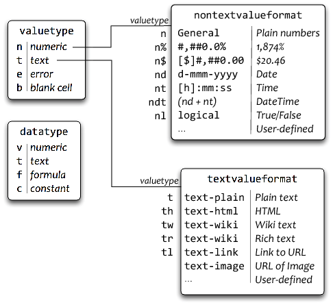

`text-wiki`值类型的支持定义在`SocialCalc.format_text_for_display`

```javascript
if (SocialCalc.Callbacks.expand_wiki && /^text-wiki/.test(valueformat)) {
    // 处理wiki markup文本
    displayvalue = SocialCalc.Callbacks.expand_wiki(
        displayvalue, sheetobj, linkstyle, valueformat
    );
}
```

这里不直接把wiki-to-HTML的扩展定义在`format_text_for_display`，而是在`SocialCalc.Callbacks`中定义一个新的钩子。这种做法是SocialCalc项目代码的推荐做法，这样可以足够模块化，使得wikitext可以很容易地定义其它扩展，也为不需要wikitext功能的使用者保持兼容性。

### 19.6.2 渲染Wikitext

下一步，我们用Wikiwyg[^wikiwyg]，一个JavaScript库来实现wikitext和HTML之间的转换。

我们定义`expand_wiki`函数，取出单元格中的文本，并传入Wikiwyg的wikitext解释器和HTML发射器：

```javascript
var parser = new Document.Parser.Wikitext();
var emitter = new Document.Emitter.HTML();
SocialCalc.Callbacks.expand_wiki = function(val) {
    // 把val从Wikitext转换成HTML
    return parser.parse(val, emitter);
}
```

最后一步是在电子表格初始化后执行`set sheet defaulttextvalueformat text-wiki`命令。

```javascript
// 我们假设DOM中已经存在<div id="tableeditor"/>
var spreadsheet = new SocialCalc.SpreadsheetControl();
spreadsheet.InitializeSpreadsheetControl("tableeditor", 0, 0, 0);
spreadsheet.ExecuteCommand('set sheet defaulttextvalueformat text-wiki');
```

总结起来，渲染步骤的工作流程如图19.14。

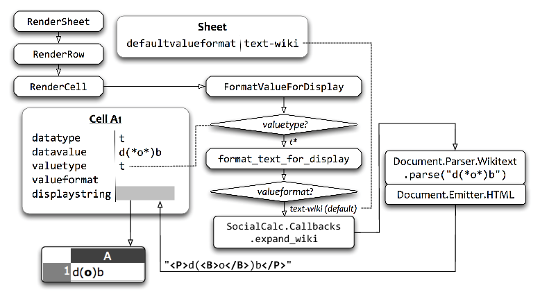

完成了！现在SocialCalc已经支持wiki markup文本语法的富文本了：

```javascript
*bold* _italic_ `monospace` {{unformatted}}
> indented text
* unordered list
# ordered list
"Hyperlink with label"<http://softwaregarden.com/>
{image: http://www.socialtext.com/images/logo.png}
```

试试在A1中输入`*bold* _italic_ \`monospace\``，然后就可以看到它被渲染成富文本了(图19.15)。

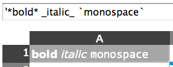


## 19.7. 实时协作

下一个例子我们会实现多用户、实时编辑共享的电子表格。这看起来非常复杂，但得益于SocialCalc的模块设计，我们只需要把每个在线用户的命令广播给所有合作者就可以了。

为区分本地命令和远程命令，我们为`ScheduleSheetCommands`方法增加了`isRemote`参数：

```javascript
SocialCalc.ScheduleSheetCommands = function(sheet, cmdstr, saveundo, isRemote) {
   if (SocialCalc.Callbacks.broadcast && !isRemote) {
       SocialCalc.Callbacks.broadcast('execute', {
           cmdstr: cmdstr, saveundo: saveundo
       });
   }
   // …ScheduleSheetCommands的原始代码…
}
```

下面，我们只需要定义合适的`SocialCalc.Callbacks.broadcast`回调函数了。一旦完成这个功能，同样的命令就会在所有连接了同一个电子表格的用户的客户端执行。

这个特性最初是SEETA的Sugar Labs[^sugar-labs]在2009年为OLPC(One Laptop Per Child[^olpc])实现的。`broadcast`函数通过对D-Bus/Telepathy发起XPCOM调用实现，基于OLPC/Sugar网络的标准传输协议(图19.16)。

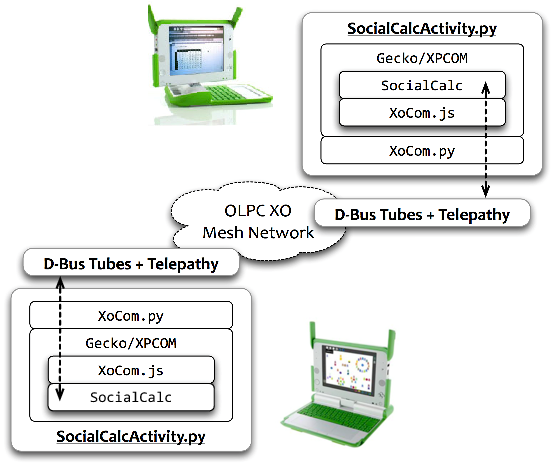

这个实现没有什么问题，使得同一个Sugar网络中的XO实例可以协同编辑SocialCalc电子表格。但因为是为Mozilla/XPCOM浏览器平台定制，并且基于D-Bus/Telepathy消息平台，使用上有各种限制。

### 19.7.1. 跨浏览器传输

为使得协同编辑可以跨浏览器、跨操作系统，我们采用了`Web::Hippie`[^web-hippie]框架，一个高度抽象的基于WebSocket的JSON通信服务，它有方便的jQuery绑定，并且如果WebSocket不可用，还会采用MXHR(Multipart XML HTTP Request[^mxhr])来替代。

在装了Adobe Flash插件但没有原生WebSocket支持的浏览器上，我们采用web_socket.js[^web-socket-js]项目的基于Flash的WebSocket实现，这个实现通常比MXHR更快并且更可靠。操作流程如图19.17。

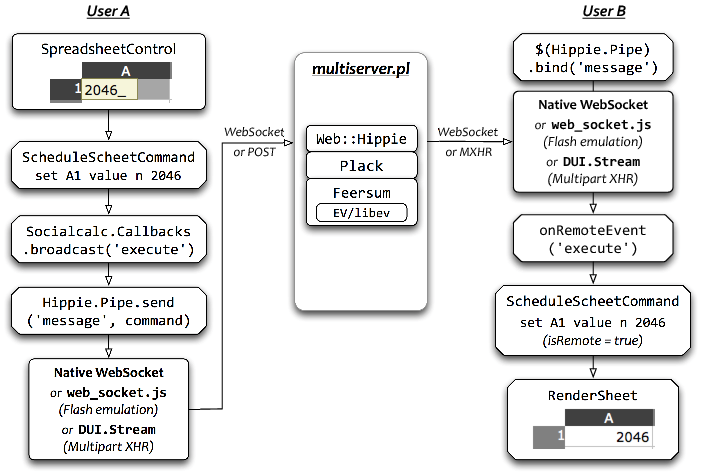

客户端的`SocialCalc.Callbacks.broadcast`函数定义如下：

```javascript
var hpipe = new Hippie.Pipe();

SocialCalc.Callbacks.broadcast = function(type, data) {
    hpipe.send({ type: type, data: data });
};

$(hpipe).bind("message.execute", function (e, d) {
    var sheet = SocialCalc.CurrentSpreadsheetControlObject.context.sheetobj;
    sheet.ScheduleSheetCommands(
        d.data.cmdstr, d.data.saveundo, true // isRemote = true
    );
    break;
});
```

这个逻辑已经可以正常工作，但仍然存在两个问题。

### 19.7.2. 解决冲突

第一个是命令执行时的竞争条件：如果用户A和用户B同时对同一个单元格进行操作，然后接收到并执行来自对方广播的命令，那么他们最终电子表格里的状态会不一致，如图19.18。

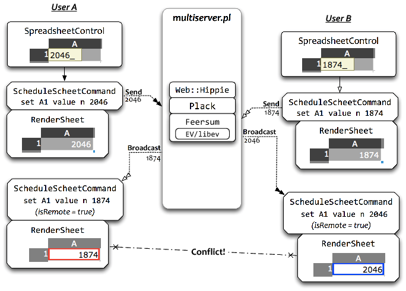

这个问题可以利用SocialCalc内置的撤销／重做机制来解决，如图19.19。

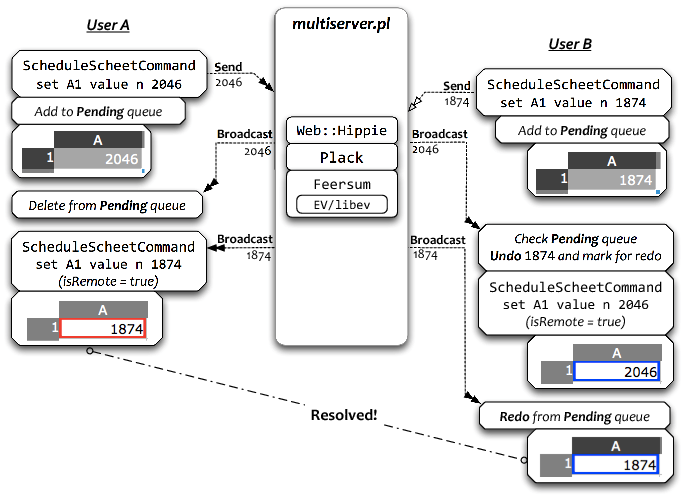

解决冲突的流程如下。当客户端广播一个命令时，它会把命令加到等待队列。当客户端接收到远程命令时，它会去等待队列里检查。

如果等待队列是空的，那么只需要执行远程命令即可。如果远程命令和等待队列中的命令匹配，那么本地的命令会被移除。

此外，客户端还会检查命令队列里是否存在和接收命令冲突的命令。如果有，客户端会首先撤销这些命令，并且标记这些指令“稍后重做”。等撤销完冲突命令后，远程命令照常执行。

当从服务器接收到“稍后重做”的命令时，客户端会再次执行这些命令，并且把它们从队列中移除。

### 19.7.3. 远程光标

即便解决了竞争条件冲突的问题，我们还是不推荐去更改别人正在编辑的单元格。一个简单的改进方案是，把每一个客户端当前的光标位置广播出去，从而可以通知所有用户当前那些单元格正在被编辑。

为实现这个方案，我们为`MoveECellCallback`事件添加了一个`broadcast`：

```javascript
editor.MoveECellCallback.broadcast = function(e) {
    hpipe.send({
        type: 'ecell',
        data: e.ecell.coord
    });
};

$(hpipe).bind("message.ecell", function (e, d) {
    var cr = SocialCalc.coordToCr(d.data);
    var cell = SocialCalc.GetEditorCellElement(editor, cr.row, cr.col);
    // …为远程用户制定单元格样式…
});
```

要在电子表格中突出某个单元格，常用的方法是使用带颜色的边框。不过某个单元格也许已经定义了`border`属性，又因为`border`是单色的，因此每次只能在同一个单元格是展示一个光标。

因此，在支持CSS3的浏览器中，我们使用`border-shadow`属性来在同一个单元格显示多个光标：

```javascript
/* 同一个单元格有两个光标 */
box-shadow: inset 0 0 0 4px red, inset 0 0 0 2px green;
```

图19.20显示了如果有四个人同时编辑同一个电子表格时的屏幕外观。

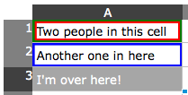

## 19.8. 收获

SocialCalc 1.0版本在2009年10月19日发布，刚好是VisiCalc初始发行的30周年。在Dan Bricklin的指导下和在SocialCalc的同事合作开发的经历对我而言非常宝贵，我也想和大家分享一下那段时间我的收获。

### 19.8.1. 有清晰愿景的主设计师

在《设计原本》[^the-design-of-design]中，Fred Brooks指出，在构建复杂系统时，如果我们能专注于连贯的设计理念，那么信息互通可以更流畅，而不会产生分歧。据Brooks的观点，这样连贯的设计理念最好是掌握在某个人心中：

> 因为概念完整性是一个伟大设计中最重要的因素，而这通常只源自于某个或者少数头脑，因此英明的管理者会大胆把每个设计任务放任给某个有天分的主设计师。

SocialCalc的情况正是如此，我们的主用户体验设计师Tracy Ruggles正是项目能趋近一个共同愿景的关键所在。SocialCalc底层引擎具备相当可观的延展性，堆叠功能的诱惑无处不在。Tracy的利用设计草图沟通的能力最终帮助我们把特性更直观地呈现给用户。

### 19.8.2. 利用wiki助长项目延续性

我加入SocialCalc项目时，整个项目已经经历了两年的持续设计和开发，而我之所以能在短短一个星期内就能跟上节奏开始贡献代码，就是因为所有信息都在wiki里。从最早的设计笔记，到最新近的浏览器支持模型，整个进程都被积累在wiki页面和SocialCalc电子表格里。

通过阅读项目工作空间的内容，我快速跟上了我的同事们，而没有通常意义上指导和定向新成员的额外开销。

在传统的开源项目中，这几乎是不可能的。传统的开源项目通常使用IRC和邮件列表来沟通，而wiki（如果有的话）仅仅用于保存文档或者开发资源链接。对新人而言，从非结构化的IRC日志或者邮件存档里是很难去还原上下文的。

### 19.8.3. 拥抱时区差异

Ruby on Rails的创始人David Heinemeier Hansson在加入37signals时曾这么指出分布式开发团队的好处：“Copenhagen和Chicago之间7个时区的差异意味着我们可以在非中断的情况下做得更多。”台北[^taipei]和Palo Alto之间有着9个时区的差异，在SocialCalc的开发过程中，我对此深有同感。

我们通常能在一天24小时内完成整个设计、开发、QA反馈的流程。每方面会占去某个人8小时的工作。这种异步协作的方式迫使我们产出自描述的成果（设计草稿、代码和测试等），反过来又极大地提高了成员彼此间的信任。

### 19.8.4. 趣味优化

我2006年在CONISLI会议上分享过自己带领分布式团队开发Perl 6语言的经验，这是演讲的主题[^optimizing-for-fun]。其中，对分布式的小开发团队而言，有几点比较关键：*一定要有规划图，宽容>放纵，消除死锁，征求意见，不求完全达成共识，用代码描述创意等*。

在SocialCalc的开发过程中，我们非常注重通过共享的代码权限在不同的团队成员之间普及项目信息，因此没有人会成为关键的瓶颈。

此外，我们会通过实际地编码实现备选方案的方式，当有更好的设计方案时，不会害怕去取代当前已经比较完备的原型。

这些团队文化特质使得我们培养了前瞻意识以及更好的友谊。虽然没有面对面的互动，我们还是摒弃了办公室政治，使得为SocialCalc工作这件事变得非常有趣。

### 19.8.5. 案例测试驱动开发

在加入Socialtext之前，我一向主张“规范的交错测试”方法，这一点在Perl 6规范[^perl6specification]中有所体现。我们通过官方的测试集来阐释Perl 6的语言规范。不过SocialCalc的QA团队，Ken Pier和Matt Heusser使我大开眼界，教会我如何把测试用例变为*可执行的标准*。

在《优雅的测试》[^beautiful-testing]一书的第16章中，Matt把我们的案例测试驱动开发流程描述如下：

> 最基础的工作单位是“案例”，也就是一个极致简单的需求文档。一个案例中包含了特性的描述，以及描述完成案例所需功能的用例。我们把这些用纯英文书写的用例称为“验收用例”。

> 在开发者写下任意一行代码之前，产品负责人就要和开发者，和测试人员反复讨论，尝试写出合适的验收用例。

这些案例测试会被转译成wikitests，一种受Ward Cunningham的FIT框架[^fit-framework]启发的基于表格的标准语言。wikitests可以驱动诸如`Test::WWW::Mechanize`[^test-www-mechanize]和`Test::WWW::Selenium`[^test-www-selenium]这样的自动化测试框架。

要讲清楚把案例测试作为解释规范需求的通用语言的好处，它的确削减了误解，还为我们淘汰了每月发布前的回归测试。

### 19.8.6. 以[CPAL协议](https://en.wikipedia.org/wiki/Common_Public_Attribution_License)开源

最后，也尤为重要的一点，我们为SocialCalc选择的开源模型本身也是个不错的收获。

Socialtext为SocialCalc创造了Common Public Attribution License[^cpal]协议。CPAL基于Mozilla Public License协议，它允许原作者要求使用其开源项目的产品在用户界面上显示项目标识，并且指定了网络使用条款，要求当开源项目在基于网络的服务中使用时，服务也需要共享相似的协议。

在CPAL协议获得了开放源代码促进会[^open-source-initiative]和自由软件基金会[^free-software-foundation]的认可后，我们很欣慰地看到，一些顶级站点，譬如Facebook[^facebook]和Reddit[^reddit]都选择CPAL作为它们平台上的开源代码协议，这让我们大受鼓舞。

因为CPAL本身是“弱[copyleft](https://en.wikipedia.org/wiki/Copyleft)”协议，开发者可以自由地把它和免费或者授权软件进行组合，并只需要修改SocialCalc本身。这就使得更多社区可以参与进来，为SocialCalc添砖加瓦。

这个开源电子表格引擎有着很多耐人寻味的可能性，我们很希望看到你也能把SocialCalc嵌入自己喜欢的项目中去。

## 文档信息

项目 | 内容
---- | ----
原文链接 | [http://www.aosabook.org/en/socialcalc.html](http://www.aosabook.org/en/socialcalc.html)
原文作者 | [Audrey Tang](https://github.com/audreyt)
本文链接 | [http://blog.leungwensen.com/2016/socialcalc.md](http://blog.leungwensen.com/2016/socialcalc.md)


如果发现翻译问题，欢迎反馈：[leungwensen@gmail.com](mailto:leungwensen@gmail.com)

[^wikiwyg]: https://github.com/audreyt/wikiwyg-js
[^olpc]: http://one.laptop.org/
[^sugar-labs]: http://seeta.in/wiki/index.php?title=Collaboration_in_SocialCalc
[^web-hippie]: http://search.cpan.org/dist/Web-Hippie/
[^mxhr]: http://about.digg.com/blog/duistream-and-mxhr
[^web-socket-js]: https://github.com/gimite/web-socket-js
[^perl6specification]: http://perlcabal.org/syn/S02.html
[^fit-framework]: http://fit.c2.com/
[^test-www-mechanize]: http://search.cpan.org/dist/Test-WWW-Mechanize/
[^test-www-selenium]: http://search.cpan.org/dist/Test-WWW-Selenium/
[^cpal]: https://www.socialtext.net/open/?cpal
[^open-source-initiative]: http://opensource.org/
[^free-software-foundation]: http://www.fsf.org
[^facebook]: https://github.com/facebook/platform
[^reddit]: https://github.com/reddit/reddit
[^the-design-of-design]: Frederick P. Brooks, Jr.: The Design of Design: Essays from a Computer Scientist. Pearson Education, 2010.
[^taipei]: 原文作者[唐凤](https://en.wikipedia.org/wiki/Audrey_Tang)是台湾著名自由软件程序员，Haskell语言和Perl语言的核心贡献者之一，也是Haskell和Perl社区的领导者之一。
[^optimizing-for-fun]: Audrey Tang: "–O fun: Optimizing for Fun". http://www.slideshare.net/autang/ofun-optimizing-for-fun, 2006.
[^beautiful-testing]: Adam Goucher and Tim Riley (editors): Beautiful Testing. O'Reilly, 2009.

