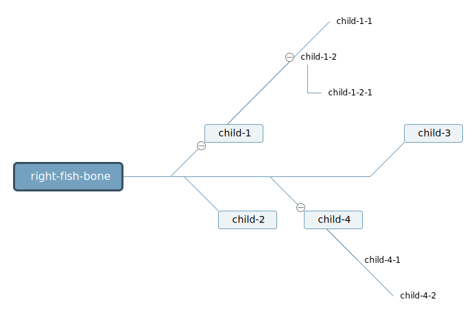
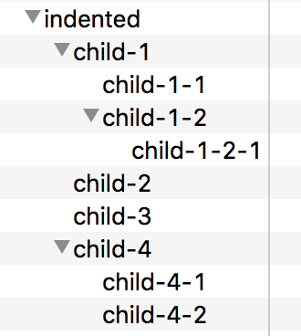

思维导图自动布局算法
=================

## 概述

为了让整理思路的过程更流畅，市面上的思维导图软件一般采用自动布局，使用户不必关心图形布局也能画出比较优美的思维导图。而为了用相对较小的代价（需要实时交互，实时布局）实现自动布局，常见的思维导图软件处理的图数据格式都是树形数据（严格地说，是有序根树，即ordered rooted tree）。本文以经典思维导图软件XMind接受的数据格式为例，汇总常见的思维导图自动布局算法。

### 输入

```javascript
{
    "root": {
        "label": "root",
        "children": [
            {
                "label": "child-1",
                "children": [
                    {
                        "label": "child-1-1"
                    },
                    {
                        "label": "child-1-2",
                        "children": [
                            {
                                "label": "child-1-2-1"
                            }
                        ]
                    }
                ]
            },
            {
                "label": "child-2"
            },
            {
                "label": "child-3"
            },
            {
                "label": "child-4",
                "children": [
                    {
                        "label": "child-4-1"
                    },
                    {
                        "label": "child-4-2"
                    }
                ]
            }
        ]
    },
    "links": [
        {
            "source": "child-1-1",
            "label": "special link",
            "target": "child-2"
        }
    ]
}
```

> root及其子孙是思维导图里的节点，对应XMind里的Topic

> links是思维导图节点间非继承关系的额外联系，对应XMind里的Relationship

更多关于.xmind文件的结构可参见[xmind-sdk-javascript](https://github.com/leungwensen/xmind-sdk-javascript)

### 输出

```javascript
{
	"nodes": [], // 带坐标信息的节点
	"edges": [], // 带起点终点坐标信息的边
}
```

## 算法汇总

### 标准布局 standard


#### 特点

1. Root节点的子节点先左后右布局。左边子节点后续节点往左，右边子节点后续节点往右。
2. Root节点的子节点围绕Root节点带向内的弧度紧凑布局。
3. Root节点后两层以后的子节点和所在层子节点垂直对齐（右边节点左对齐，左边节点右对齐）。
4. 布局时以Root节点为中心布局，布局完毕所有节点整体相对画布居中。

#### 使用场景

这种布局是经典的脑图布局，能比较直观地描绘发散的大脑思维，帮助人合并不同来源的资料，整理复杂的问题。

#### 算法描述

### 右向逻辑布局 right logical


#### 特点

1. 从左往右布局各个层次的节点。
2. 和经典的树图或者分层布局不同的地方在于，每个节点的位置只相对于父节点，和其他父节点不同的同层次节点位置不相关。
3. 是所谓的"非分层紧凑树布局"。

#### 使用场景

这种布局就是经典的树图层次结构布局，适合有明显分层的信息。譬如总结信息，族谱，目录结构和记录笔记等。

### 向下组织结构布局 downward organizational


### 向下目录组织布局 downward tree organizational


### 右向鱼骨布局 right fish bone



### 缩进布局 indented



<!--
### 向上组织结构布局 upward organizational

### 向下逻辑布局 downward logical

### 左向鱼骨布局 left fish bone

### 右向树布局 right tree

### 左向树布局 left tree

### 弧树布局 arc tree

### 肘树布局 elbow tree

### 水平时间轴 horizontal Timeline

### 垂直时间轴 vertical Timeline
-->

## 相关链接

- 算法实现：[mindmap-layouts](https://github.com/leungwensen/mindmap-layouts)

## 附录

### 树布局的美学标准

1. 节点之间不重叠
2. 子节点按照指定的顺序排列
3. 父节点在子节点中心
4. 某棵子树的绘制不取决于其在树中的位置，同样的子树绘制结果应该一致
5. 树的反射的布局中，每个子节点顺序和原来布局相反
